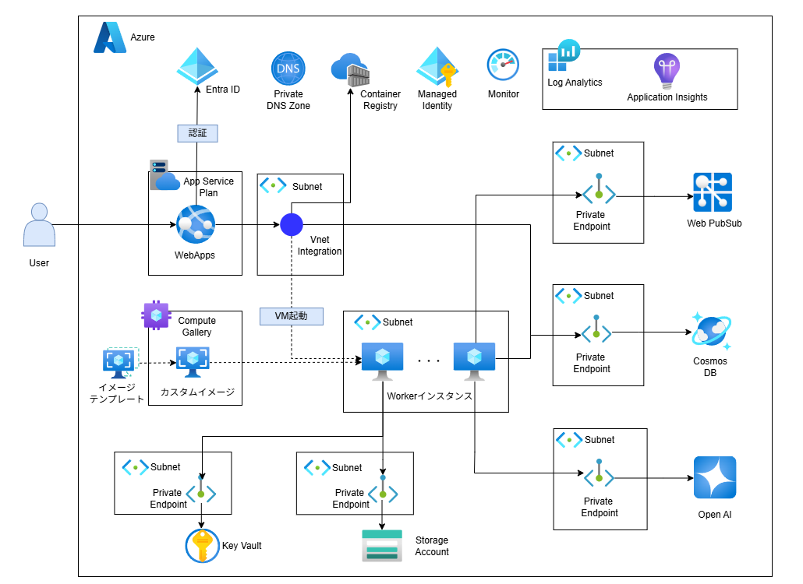

# Remote SWE Agents Azure

**Remote SWE Agents Azure** は、AWSサンプルで公開されている [remote-swe-agents](https://github.com/aws-samples/remote-swe-agents)をAzureに置き換えたものです。

> Note::  
> まだ移行できていない点や、実装不備がある状態ですので、参照する場合はその点ご了承ください。

## アーキテクチャ

